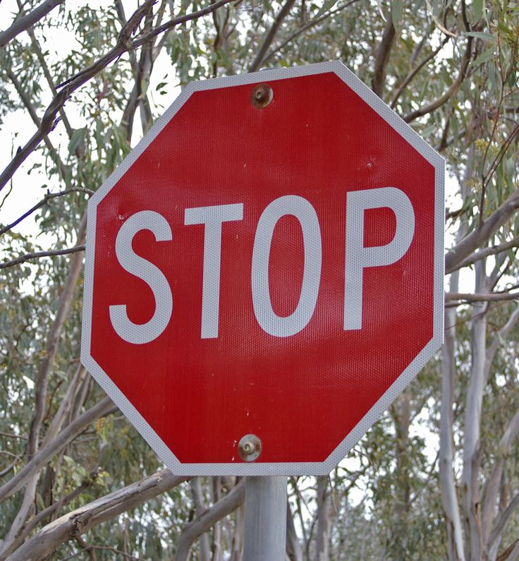

# **Traffic Sign Classification** 

## Writeup

**Build a Traffic Sign Classification Project**

The goals / steps of this project are the following:
* Load the data set (see below for links to the project data set)
* Explore, summarize and visualize the data set
* Design, train and test a model architecture
* Use the model to make predictions on new images
* Analyze the softmax probabilities of the new images
* Summarize the results with a written report

## Rubric Points
### Here I will consider the [rubric points](https://review.udacity.com/#!/rubrics/481/view) individually and describe how I addressed each point in my implementation.  

---
### Writeup / README

This is a summary of the work done to train the traffic sign classifier based on a deep neural network. The Github project is located [here] (https://github.com/udacity/CarND-Traffic-Sign-Classifier-Project/blob/master/Traffic_Sign_Classifier.ipynb)

### Data Set Summary & Exploration

The dataset exploration was done in a simple way using the Numpy library, as the dataset loaded using pickle is stored as numpy arrays. 

* The size of training set is 34799
* The size of the validation set is 4410
* The size of test set is 12630
* The shape of a traffic sign image is 32 by 32 pixels
* The number of unique classes/labels in the data set is 43

The distribution of the images in the training dataset is shown in following picture. 


We can see that the number of images per class in the training dataset varies by approximately 10x between the classes with the most training examples and the classes with the least. This is not an ideal situation, because the network may learn to work better on the classes with more examples, at the expense of the classes with fewer examples. Ideally, all classes that we want the network to learn should be represented about equally, in terms of the number of images, variety in the images, etc. 

### Design and Test a Model Architecture

#### Pre-processing the image data

All three datasets (training, validation and testing) were pre-processed in two steps:
- Convert from RGB to grayscale using the method `rgb2gray`
- Normalize the grayscale images to have zero mean and unit variance using the method `normalize`

Conversion from RGB to grayscale is typically done to make the models simpler and smaller. However, sometimes having the color information could help the network to learn to classify better, if the color is indeed a decisive factor between the classes. In the case of traffic signs, it is probably not necessary to have the color information, because the traffic signs can be distinguished well even if the images are converted to grayscale for the purpose of classification. This is after all confirmed with the training and testing processes, which produce good results on grayscale images. 

Normalization is typically done to ensure that the input data to the network has similar distribution, which helps the network to converge faster during training. If normalization isn't done, we could have a situation that very bright and very dark images affect the training process negatively because the brightness factor may be something that the network also tries to learn, and that is not what we want. 

Below, we can see the result of changing the images from RGB to grayscale. We first show 42 RGB images from 42 different classes, and then we show the same images converted to RGB. We show only 42 images even though there are 43 classes, just to have the nice 7x6 grid for displaying the images (this is dufficient for illustration purposes). 

- RGB images:


- Grayscale images:


#### The model architecture

The neural network chosen for this work resembles the LeNet network architecture, and has the following layers:

My final model consisted of the following layers:

| Layer         		|     Description	        					| 
|:---------------------:|:---------------------------------------------:| 
| Input         		| 32x32x3 RGB image   							| 
| Convolution 5x5     	| 1x1 stride, VALID padding, outputs 28x28x6 	|
| RELU					|												|
| Max pooling	      	| 2x2 stride,  outputs 14x14x6 				|
| Convolution 5x5     	| 1x1 stride, VALID padding, outputs 10x10x16 	|
| RELU					|												|
| Max pooling	      	| 2x2 stride,  outputs 5x5x16 				|
| Fully connected		| On the flat input, output is 120        									|
| RELU					|												|
| Fully connected		| Output is 84        									|
| RELU					|												|
| Fully connected		| Output is 43        									|
| Softmax				|     									|
 
 
#### The training process

For training, several different experiments were performed to investigate the impact of different settings and hyperparameters for achieving the desired accuracy. The list of settings experimented with includes the following:
- **Input data format:** use RGB images vs. grayscale without normalization vs. grayscale with normalization. Between the three different options, the last one was a clear winner to get the training process and testing converge quickly. Therefore, the model uses grayscale and normalized pictures (both for training and testing). 
- **Learning rate:** use a constant learning rate vs. a decaying learning rate. It is often recommended that the learning rate is best lowered later in the training process, to achieve faster learning rate at the beginning and more precise convergence later. However, with the experiments performed here, it was noticed that the best convergence happens with the constant learning rate. 
- **Optimizers:** use different optimizers (AdamOptimizer, RMSPropOptimizer, GradientDescentOptimizer). The impact of selecting different optimizers did not appear to influence the results, so eventually AdamOptimizer was chosen for the reasonce mostly involving prior experiences with that optimizer. 
- **L2 loss:** use L2 loss for weights vs. do not use L2 loss. Using L2 loss was a clear winner here, as the accuracy for both validation and testing datasets was increased by several percentages over the case where L2 loss was not used. 
- **Dropout:** use dropout for conv layers and FC layers vs. use dropout only for conv layers vs. do not use dropout at all. Using dropout only for conv layers was the better choise vs. using dropout also for the FC layers or not using dropout at all, resulting in the improvement in the validaton adn testing accuracy of several percentage points. 
- **Number of training epochs:** increase the number of training epochs. The initial number of epochs was 10, but it was eventually increased to 60. The runtime penalty is not significant because the training procedure runs relatively fast anyway (about 2-3 minutes for 60 epochs). 

The architecture was not changed during these experiments. The approach was to pick a reasonable architecture from the beginning (which is relatively small and simple) and to try to train it to get the desired accuracy. The architecture can be made deeper, with more layers, but this was eventually not necessary. 

During training, at the end of every epoch, the accuracy of the model is evaluated using the validation dataset. In other words, at the end of each epoch we have the estimate of how accurate the model is on the data it has not seen during the training. The accuracy is around 0.4 after the first epoch, over 80% after 5 epochs, over 90% after 12 epochs, and then slowly goes up to about the peak of 94%. At the end of the training, we evaluate the accuracy once more using the test dataset. The accuracy in that case is 94.6%, which exceeds 93% (which was set as a requirement at the beginning). 

### Testing the model on new images

For additional testing, several images were downloaded from the internet and placed in the directory `test_images`:

```test_images/11_rightofway.jpg```


```test_images/14_stop.jpg```



```test_images/17_noentry.jpg```


```test_images/17_noentry_crop.jpg```


```test_images/23_slippery.jpg```


```test_images/23_slippery_crop.jpg```


```test_images/25_roadwork.jpg```


```test_images/25_roadwork_2.jpg```


The images are named in the way that the names begin with the number designating the class ID, as defined in the `signnames.csv` file. In that way, we do not have to store the labels separately, but we simply extract them from the file names. 

As we test the model with these immages, we can see the following output:

```
Image correctly classified: 11_rightofway.jpg as class 11
Image correctly classified: 14_stop.jpg as class 14
Image incorrectly classified: 17_noentry.jpg as class 0
Image correctly classified: 17_noentry_crop.jpg as class 17
Image incorrectly classified: 23_slippery.jpg as class 38
Image correctly classified: 23_slippery_crop.jpg as class 23
Image correctly classified: 25_roadwork.jpg as class 25
Image correctly classified: 25_roadwork_2.jpg as class 25**
```

The reason why the images `17_noentry.png` and `23_slippery.png` are not correctly classified is most likely due to the fact that these images do not just show the traffic sign in a zoomed-in kind of way, but they also have substantial area around the signs, which show branches and leaves. The training dataset, on the other hand, shows only traffic sign images where the signs occupy the entire area of the images, and nothing else is shown. So the model learns to recognize the signs only in the absence of other content. That is why I think `17_noentry.jpg` is classified incorrectly, but `17_noentry_crop.jpg` is classified correctly. The latter image shows the same sign as the former, but simply the content around the sign itself has been removed. The situation is the same with `23_slippery.jpg` and `23_slippery_crop.jpg`. 

To investigate how confident the model is when predicting these two images, we can look at the following output from notebook:

```
Image 11_rightofway.jpg predicted as 11
Top 5 classes [[11 30 21 12 27]]
Top 5 values [[ 0.92752033  0.06129503  0.00334978  0.00217773  0.00173397]]

Image 14_stop.jpg predicted as 14
Top 5 classes [[14 33 13 17 34]]
Top 5 values [[ 0.91339582  0.01729976  0.01514864  0.0130596   0.00775108]]

Image 17_noentry.jpg predicted as 0
Top 5 classes: 0  1  8 33 36
Top 5 values: 0.25731021  0.10710046  0.09363007  0.0816074   0.05592449

Image 17_noentry_crop.jpg predicted as 17
Top 5 classes: 17  9 33 16 35]]
Top 5 values: 0.48428649  0.17560029  0.10189056  0.09391738  0.05823837

Image 23_slippery.jpg predicted as 38
Top 5 classes: 38 25 31 11 23
Top 5 values: 0.29157507  0.14607479  0.12122528  0.0940006   0.04848812

Image 23_slippery_crop.jpg predicted as 23
Top 5 classes: 23 11 19 21 31
Top 5 values: 0.41349074  0.19613142  0.11798017  0.07410568  0.069729  

Image 25_roadwork.jpg predicted as 25
Top 5 classes: 25 31 29 21 30
Top 5 values: 0.62263769  0.08411928  0.05425425  0.04839035  0.04740327

Image 25_roadwork_2.jpg predicted as 25
Top 5 classes: 25 29 24 22 18
Top 5 values: 0.98748207  0.00331216  0.00220919  0.00131308  0.00117823
```

We can see that some correct predictions have a very high probability of over 90%, but some have less than 50%. Compared to the cases where the predictions are incorrect, we still see that the output probabilities are relatively higher, and the margins with the second highest probabilities is relatively wider, compared to mis-predictions. 
